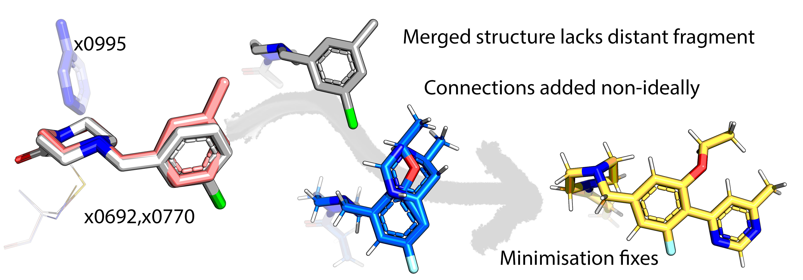

# Fragmenstein
Scaffold hopping between bound compounds by stitching them together like a reanimated corpse.

## Aim
Given a followup molecule and a series of hits it makes a spatially stitched together version of the followup based on the hits.
Like Frankenstein's creation it may violate the laws of chemistry. Planar trigonal topologies may be tetrahedral, bonds unnaturally long _etc._
This monstrosity is therefore then energy minimised with strong constraints.

Here is [an interactive example of mapped molecules](https://michelanglo.sgc.ox.ac.uk/r/fragmenstein).

It is somewhat tolerant to erroneous/excessive submissions (by automatically excluding them)
and can energy minimised strained conformations.

### Side role: follow prediction
It can also merge fragment hits by itself and find the best scoring mergers
—with a good amount of impossible chemistry thrown in ([example](https://www.well.ox.ac.uk/~matteo/fragmenstein_pairwise.html)).

## Not-docking
As a consequence, it is not really a docking algorithm as it does not find the pose with the lowest energy 
within a given volume. Consequently, it is a method to find how faithful is a given followup to the hits provided.
Hence the minimised pose should be assessed by the RMSD metric and the ∆∆G score used solely as a cutoff —lower than zero.

## Dramatis personae

> Victor, the pipeline, requires my [rdkit to params module](https://github.com/matteoferla/rdkit_to_params).

There are four main classes:

* ``Fragmenstein`` makes the stitched together molecules — [documentation](fragmenstein.md)
* ``Igor`` uses PyRosetta to minimise in the protein the fragmenstein followup — [documentation](igor.md)
* ``Victor`` is a pipeline that calls the parts, with several features, such as warhead switching —[documentation](victor.md)
* ``mRMSD`` is a multiple RMSD variant which does not align and bases which atoms to use on coordinates —[documentation](mrmsd.md)

In the absence of `pyrosetta` (which requires an academic licence), `Fragmenstein` and `mRMSD` work.

## Work in progress

Some changes to the algorithm are currently underway, see [wip.md](wip.md) for more or drop me (matteo) an email.

## Laboratory

> See [Fragmenstein and COVID moonshot](covid.md).

Fragmenstein was created to see how reasonable are the molecules of fragment mergers submitted
in [the COVID moonshot project](https://discuss.postera.ai/c/covid), because after all the underlying method is 
fragment based screening.
[This dataset](https://github.com/postera-ai/COVID_moonshot_submissions) has some unique peculiarities that potentially
are not encountered in other projects.

## Autogenerated documentations

For more see the source code or the [Sphinx converted documentation](sphinx-docs.md).

