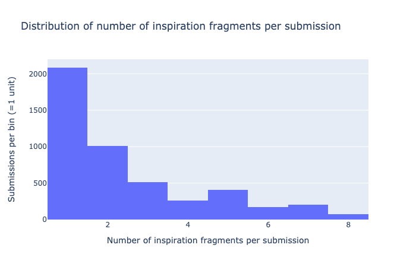

# Covid and Fragmenstein

Fragmenstein was sparked to life by COVID Moonshot project [the COVID moonshot project](https://discuss.postera.ai/c/covid).
[This dataset](https://github.com/postera-ai/COVID_moonshot_submissions) has some unique peculiarities that potentially
are not encountered in other projects. Namely, humans look at the bound fragments and suggest followups via the form.
However, there are some problems:

* the form does not have a `no inspiration hit` option, so many users submitted `x0072` the first as inspiration when submitting docked libraries.
* the inspiration hits are common to a group of submissions by a user, even if one went into one and another to another.
* some pockets have many hits, so a large amount of not fully overlapping hits are submitted
* some users submitted a mispelt hit

## Custom class

    from fragmenstein.mpro import MProVictor
    
This class has everything set up.

* `MProVictor(smiles: str, hits:List[Chem.Mol], long_name:str, category:Optional[str]=None)`
* `MProVictor.from_hit_codes(smiles: str, hit_codes:List[str], long_name:str, category:Optional[str]=None)`
* `MProVictor.get_mpro_path()` --> Folder with the package with `template.pdb` and `hit_mols` folder
* `MProVictor.get_mol(xcode:str)` (covalent if covalent)
* `MProVictor.combine_codes(cls, hit_codes: List[str])`
* `MProVictor.combine(hits:List[Chem.Mol])`
* `MProVictor.fetch_postera()` --> Pandas dataframe from GitHub

For an example of the script used, see [covid.py](covid.py).
Note that this script runs on multiple cores. For a fews smiles, which takes about 30 seconds each there is no need.
Also note that some molecules get stuck due to incorrectly entered inspirations.

For a comparision of how the three method fair with the daset see [three modes compared](three_modes_compared.md).

## Over-inspired problem

Fragmenstein full-merge mapping works well for two

The 'TRY-UNI-714a760b-1' compound (`Cc1c(N)cncc1NC(=O)CC1CCCCC1`) is purported to be inspired by x0107, x0434, x0678, x0748, x0995, x1382.

This takes forever to make a template... which comes out awful.

When placed and minimised the compound drifts off. The reason for this is that there are only two atoms that map.

In reality only x0107, x0678, x0995 were the true inspirations. When this is corrected, the scaffold is basically the followup.

So the question is: how does one fix this?
Before that it is best to see how frequent this is:

Of the 2,000 with 1 hit as inspiration, 500 are based upon x0072.
These are not really inspirations, just a case where `null` was not a choice.

The wobbly extras are good to set bounds for the coordinate constraints...

## Regen data

PDB files can be downloaded off Fragalysis. These need some converting.
Luckily now the hits also have CID codes in PostEra's csv, so the SMILES can come from there.

    from fragmenstein.mpro import MProVictor
    MProVictor.enable_stdout()
    
    import os, re
    
    postera = MProVictor.fetch_postera()
    pdbfolder = '/Users/matteo/Coding/Mpro2_allPdb_13-Jun-2020'
    
    ## get CID of xcodes
    pdbfolder = '/Users/matteo/Coding/Mpro2_allPdb_13-Jun-2020'
    equivalence = {} 
    for file in os.listdir(pdbfolder):
        if re.match('Mpro2-(x\d+)\:(.*).pdb', file) is not None:
            xcode, cid = re.match('Mpro2-(x\d+)\:(.*).pdb', file).groups()
            equivalence[cid] = xcode
            
    ## extract Smiles from postera
    smilesdex = {}   
    for cid, xcode in equivalence.items():
        m = postera.loc[postera.CID == cid]
        if len(m) != 0:
            row = m.iloc[0]
            smiles = row.SMILES
            smilesdex[xcode] = smiles
        else:
            print(xcode, cid)
            
    # nitrile and chloroacetimide at the same time...
    smilesdex['x0774'] = '*CC(O)N1CCN(S(O)(O)[C@@H]2CCCCC2CN)CC1'
    # MProVictor.warhead_definitions now includes bromoalkyne by default
    
    # it will warn about covalents. But will fix them
    mols = MProVictor.extract_mols(pdbfolder, smilesdex, regex_name=r'Mpro2-(x\d+)')
    
    # save them
    for xcode in mols:
        Chem.MolToMolFile(mols[xcode], os.path.join(MProVictor.get_mpro_path(), 'hit_mols', f'Mpro-{xcode}.pdb'))